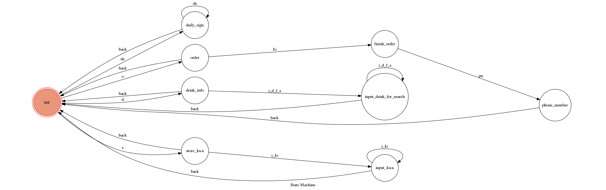

# Drinks_Bot (飲料店點餐機器人)這裡以布萊恩紅茶做測試
此聊天機器人共有5種功能：
* 點餐
* 飲品資料查詢
* 各縣市分店查詢
* 每日星座運勢查詢
* 每日定時自動回報空氣品質狀況

接下來說明各功能實際操作情形：

***點餐***
1. 輸入'o'進入點餐state
2. 輸入欲訂購的飲品名稱同時附上所需額外要求(ex:阿薩姆紅茶微糖微冰加波霸)，若欲選購多杯飲品則以一個空白間隔即可
3. 輸入你的手機號碼
4. 點餐成功!訂單已送出~~~ :+1:

***
***

***飲品資料查詢***
1. 輸入'd'進入飲品查詢state
2. server會回傳menu上的所有飲品名稱，選擇欲查詢的飲品名稱輸入
3. 重複輸入各種飲品名稱可持續查詢，欲離開此state請輸入'返回'

***
***

***各縣市分店查詢***
1. 輸入's'進入分店查詢state
2. 輸入欲查詢的地區名稱(ex:台北、新北、台中、台南… ，不需加(縣,市))
3. 重複輸入各地區名稱可持續查詢，欲離開此state請輸入'返回'

***
***

***每日星座運勢查詢***
1. 直接輸入欲查詢的星座即可(ex:天秤座、處女座、水瓶座…)
2. 重複輸入各星座可持續查詢，欲離開此state請輸入'返回'

***
***

***每日定時自動回報空氣品質狀況***
1. 每日 7:00am 自動回報當日預測空氣品質情形

***
***

## FSM Diagram

